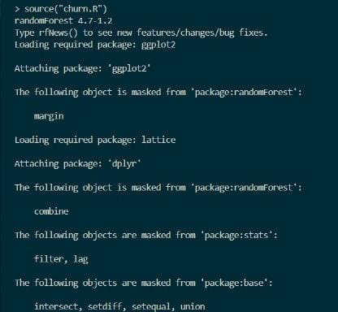
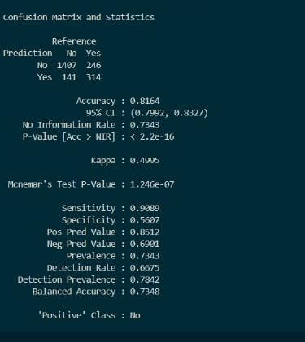
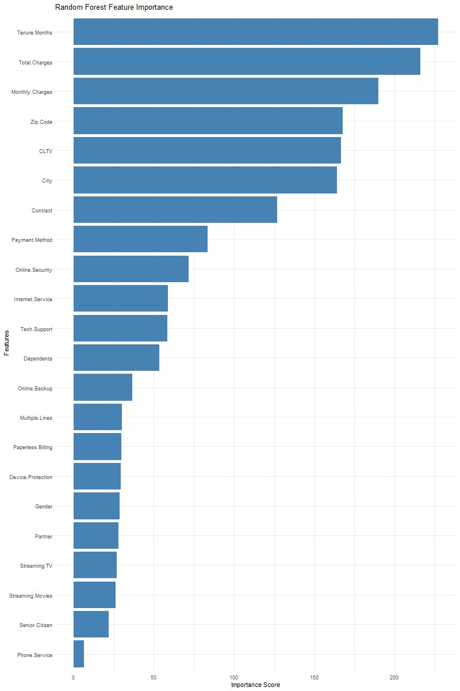

# Customer Churn Prediction Using Random Forest (R)

This project implements a **Random Forest classification model in R** to predict customer churn using customer demographics, service usage, and account information. The objective is to identify churn patterns and analyze the most influential features.

---

## 📌 Project Overview

Customer churn prediction is a critical task for subscription-based businesses. This project demonstrates a complete **machine learning pipeline in R**, including preprocessing, modeling, evaluation, and interpretation.

---

## 🧰 Technologies & Libraries

- R  
- randomForest  
- caret  
- dplyr  
- ggplot2  

---

## 📂 Dataset

- File: `customer_churn.csv`  
- Target Variable: `Churn.Label`  

> Note: The dataset is excluded from this repository using `.gitignore`.

---

## 🔄 Methodology

1. Data loading and cleaning  
2. Removal of leakage and irrelevant columns  
3. Encoding categorical variables  
4. Handling missing values  
5. Train-test split (70% / 30%)  
6. Random Forest model training  
7. Model evaluation  
8. Feature importance visualization  

---

## 📊 Model Evaluation Results

## 🖥️ R Console Execution Output



This confirms successful execution of the script and correct loading of required packages.

---

### Confusion Matrix & Performance Metrics



**Key Metrics:**
- Accuracy: **81.64%**
- Balanced Accuracy: **73.48%**
- Sensitivity: **90.80%**
- Specificity: **56.07%**
- Kappa: **0.4995**

---

## 📈 Feature Importance



The plot highlights that **Tenure Months, Total Charges, and Monthly Charges** are the most influential features affecting churn prediction.

---

## 🚀 How to Run the Project

1. Clone the repository:
```bash
git clone https://github.com/your-username/repository-name.git
```
2. Open the project in RStudio or VS Code  
3. Install required packages:
```r
install.packages(c("randomForest", "caret", "dplyr", "ggplot2"))
```
4. Place `customer_churn.csv` in the working directory  
5. Run the R script  

---

## 📌 Future Enhancements

- Hyperparameter tuning  
- Cross-validation  
- Comparison with other ML models  
- Deployment using Shiny  

---

## 👤 Author

Yashasvi Velagapudi  
Computer Science Student  

---

## 📄 License

This project is intended for academic and learning purposes.
